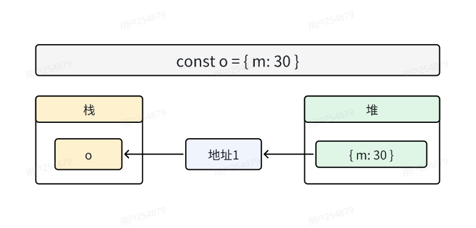
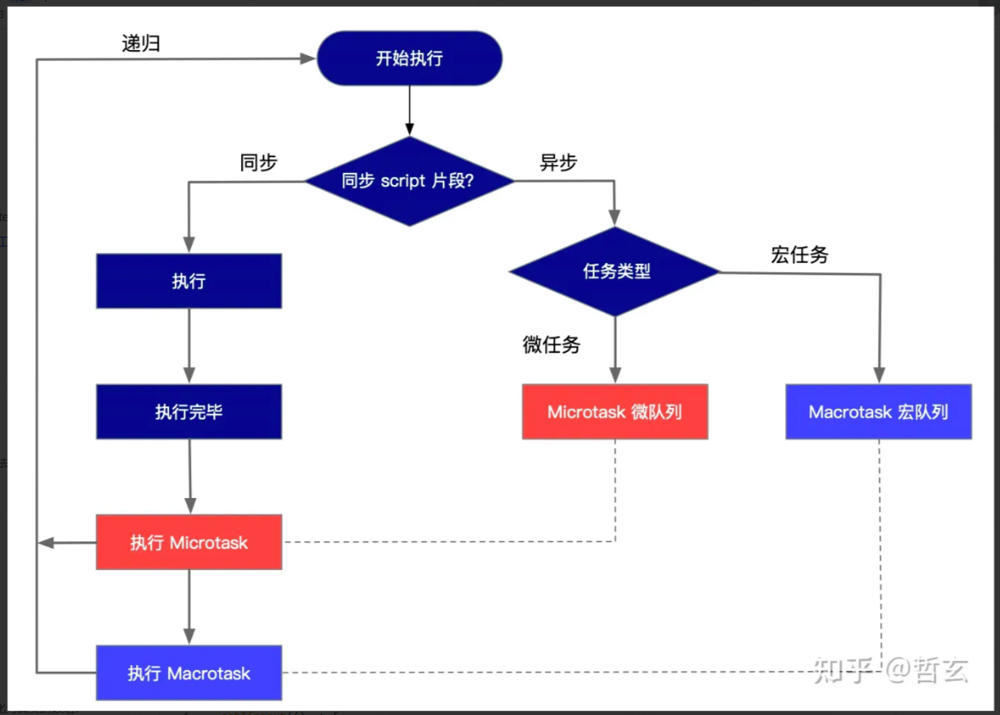
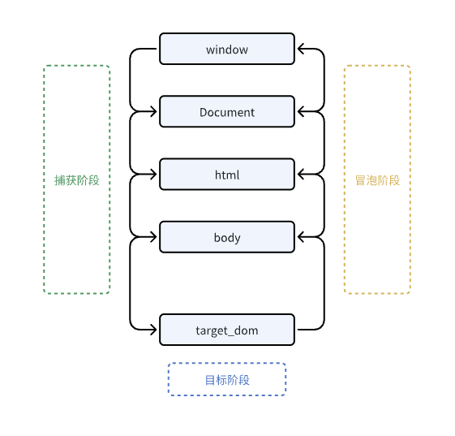

# JavaScript 面试题整理

## 1. 问题：闭包
* 当一个函数内部定义了另一个函数，并且内部函数引用了外部函数的变量，就形成了闭包。当内部函数从外部函数返回时，它会保留对外部函数作用域的引用，即使在外部函数执行完毕后，仍然可以继续访问这些变量。
* 闭包是指有权访问另一个函数作用域中变量的函数，创建闭包最常见的方法就是在一个函数内创建另一个函数，通过另一个函数访问这个函数的局部变量，利用闭包可以突破作用链域
* 闭包的特性：
    * 函数嵌套函数
    * 内部函数可以引用外层的参数和变量
    * 参数和变量不会被垃圾回收机制回收

说说对闭包得理解
* 使用闭包主要是为了设计私有的方法和变量。闭包的优点是可以避免全局变量的污染，缺点是闭包会常驻内存，会增大内存使用量，使用不当很容易造成内存泄漏。在js中，函数即闭包，只有函数才会产生作用域的概念。
* 闭包的最大用处有两个：一个是可以读取函数内部的变量，另一个就是让这些变量始终保持在内存中。
* 闭包的另一个用处，是封装对象的私有属性和私有方法。
* 好处：能够实现封装和缓存等
* 坏处：就是消耗内存，使用不当会造成内存泄漏

使用闭包的注意点：
* 由于闭包会使得函数中的变量都被保存在内存中，内存消耗很大，所以不能滥用闭包，否则会造成网页的性能问题，在IE中可能会导致内存泄漏。
* 解决方法：在退出函数之前，将不适用的局部变量全部删除
* 闭包在IE中会导致内存泄漏的原因是，IE的垃圾回收机制是基于引用计数的，当一个对象的引用计数为0时，就会被垃圾回收机制回收。但是，闭包会导致外部函数的引用计数增加，所以外部函数不会被垃圾回收机制回收。

```js
const accumulation = function(initValue = 0){
    let value = initValue
    return function(num){
        value += num
        return value
    }
}

for(var i=0;i<10;i++){
    (function (index){
        setTimeout(function(){
            console.log(index)
        },1000)
    })(i);
}
```

## 2. 问题：如何判断object为空
* 常用方法：
    * `Object.keys(obj).length === 0`
    * `JSON.stringify(obj) === '{}'`
    * `for in` 循环判断是否有属性
* 以上方法不太严谨处理不了 `const obj = {[Symbol('a')]:1}`这种情况
* 更严谨的方法： `Reflect.ownKeys(obj).length === 0`
   

## 3. 问题：强制类型转换，隐式类型转换
* 强制类型转换：使用 `Number()`, `String()`, `Boolean()` 等函数进行显式转换。
```javascript
var num = Number('123') // 123  强制将字符串转换为数字
var str = String(123) // '123'  强制将数字转换为字符串
var bool = Boolean(0) // false  强制将数字转换为布尔值
```
* 隐式类型转换：在某些情况下，JavaScript 会自动进行类型转换，例如在进行数学运算时。
```javascript
var num = 123 + '456' // '123456'  数字和字符串相加，数字会被转换为字符串
true == 1  // true  布尔值和数字比较，布尔值会被转换为数字
false == 0  // true  布尔值和数字比较，布尔值会被转换为数字
```


## 4. 问题：==和===的区别
* `==` 运算符会进行类型转换，然后比较值是否相等。
* `===` 运算符不会进行类型转换，只有在类型和值都相等时才返回 `true`。
```javascript
1 == '1' // true  数字和字符串比较，字符串会被转换为数字
1 === '1' // false  数字和字符串比较，类型不同，返回 false
true == 1  // true  布尔值和数字比较，布尔值会被转换为数字
true === 1 // false  布尔值和数字比较，类型不同，返回 false
```
**补充问题**： 当a=?以下代码成立
```javascript
if (a == 1 && a == 2 && a == 3) {
    console.log('a等于1、2、3')
}
```
```javascript
var a = {
    i: 1,
    valueOf: function () {
        return this.i++
    }
}
if (a == 1 && a == 2 && a == 3) {
    console.log('a等于1、2、3')
}
```

## 5. 问题：javascript的数据类型有哪些
* 基本数据类型：
    * 数字（Number）：表示数值，包括整数和浮点数，整数（如：123）浮点数（如：123.456）特殊数值（如：NaN、Infinity、-Infinity）
    * 字符串（String）：表示文本数据，使用单引号（'）或双引号（"）括起来，由零个或多个字符组成的序列（如：'hello'）
    * 布尔值（Boolean）：表示逻辑值，只有两个值：`true` 和 `false`
    * 空值（Null）：表示空值或不存在的对象引用（如：null）, 是一个特殊的对象值，用于表示空引用或空对象,给`typeof`传一个`null`会返回`object`。
    * 未定义（Undefined）：表示变量未被赋值（如：let a; console.log(a) // undefined）
    * 符号（Symbol）：表示唯一的标识符，用于对象属性的键（如：Symbol('a')）
* 引用数据类型：
    * 对象（Object）：表示复杂的数据结构，用于存储键值对（如：{a: 1, b: 2}）
    * 数组（Array）：表示有序的元素集合，每个元素都有一个索引（如：[1, 2, 3]）
    * 函数（Function）：表示可执行的代码块，用于封装可重复使用的逻辑（如：function () { console.log('hello') }）
* 其他引用类型：
    * 日期（Date）：表示日期和时间，用于处理日期和时间相关的操作（如：new Date()）
    * 正则表达式（RegExp）：表示模式匹配，用于在字符串中进行搜索和替换操作（如：/abc/）
    * 映射（Map）：表示键值对的集合，键可以是任意类型（如：new Map()）
    * 集合（Set）：表示唯一值的集合，集合中的值不能重复（如：new Set()）
* 在ECMAScript 2020（ES11） 中正式被添加BigInt的数据类型。用于大整数的表示和操作：
    * 结尾用n表示（如：123n）
* 基础类型存放于栈，变量记录原始值;引用类型存放于堆，变量记录引用地址。
   

## 6. 问题：javascript变量在内存中的堆栈存储
* 基础类型存放于栈，引用类型回存放在堆
* 案例：以下代码为什么输出`50 30`?
```javascript
function fn(obj){
    obj = {m: 50}
    console.log(obj.m)  // 输出50
}
let o = {m: 30}
fn(o)
console.log(o.m)    // 输出 30
```
* 解析
    * 当执行`let o = {m: 30}`时，相当于在堆内存开辟一块空间，存储`{m: 30}`，同时利用变量`o`记录该堆内存地址,`o`存放于栈。
    
    * 接着执行`fn(o)`时，将`o`变量作为实参传递给`fn`函数，相当于将`o`变量的引用地址复制一份传递给`fn`函数的参数`obj`。
    * 然后在`fn`函数中，将`obj`参数赋值为`{m: 50}`，相当于在堆内存开辟一块空间，存储`{m: 50}`，并将引用地址赋值给`obj`参数。
     
    * 然后执行`console.log(obj.m)`会根据新的引用地址，找到`{m: 50}`，输出的是`50`。
    * 而在全局作用域中，`o`变量记录的引用地址仍然是`{m: 30}`的地址，所以`console.log(o.m)`输出的是`30`。


## 7. 问题：JS单线程设计的目的
javascript是浏览器的脚本语言，主要用途是进行页面的一系列交互操作以及用户互动，多线程编程通常会引发竞态条件，死锁和资源竞争等问题，而单线程设计可以避免这些问题，多线程操作的话会出现不可预测的冲突。

假设有两个线程同时执行，一个线程修改了共享数据，而另一个线程在读取该数据时，就会出现竞态条件。为了避免这种情况，javascript采用了单线程设计，即只有一个线程在执行javascript代码，其他线程都在等待。

如果有多个任务需要执行，javascript会将这些任务放到任务队列中，按照先进先出的顺序依次执行。每个任务执行完成后，会检查是否有其他任务需要执行，如果有，就会将其放到任务队列中，也就是我们熟知的事件循环，微任务队列，宏任务队列。如果真的需要开辟一个新线程处理逻辑，也可以通过webworker实现。


## 8. 问题：如何判断javascript的数据类型
* **typeof操作符**：返回一个表示数据类型的字符串，包括`number`、`string`、`boolean`、`object`、`function`、`symbol`、`undefined`、`bigint`。
```javascript
typeof 123 // 'number'
typeof 'hello' // 'string'
typeof true // 'boolean'
typeof {a: 1} // 'object'
typeof function () {} // 'function'
typeof Symbol('a') // 'symbol'
typeof undefined // 'undefined'
typeof 123n // 'bigint'
typeof null // 'object'
```
* **instanceof操作符**：用于判断一个对象是否是某个构造函数的实例，返回一个布尔值。
```javascript
let arr = [1, 2, 3]
arr instanceof Array // true
var obj = {a: 1}
obj instanceof Object // true
function Fn() {}
let fn = new Fn()
fn instanceof Fn // true
```
* **Object.prototype.toString.call()**：返回一个表示对象类型的字符串,获取更详细的数据类型信息，包括`[object Object]`、`[object Array]`、`[object Function]`等。
```javascript
Object.prototype.toString.call(123) // '[object Number]'
Object.prototype.toString.call('hello') // '[object String]'
Object.prototype.toString.call(true) // '[object Boolean]'
Object.prototype.toString.call({a: 1}) // '[object Object]'
Object.prototype.toString.call(function () {}) // '[object Function]'
Object.prototype.toString.call(Symbol('a')) // '[object Symbol]'
Object.prototype.toString.call(undefined) // '[object Undefined]'
Object.prototype.toString.call(123n) // '[object BigInt]'
Object.prototype.toString.call(null) // '[object Null]'
```
* Array.isArray()：用于判断一个对象是否是数组，返回一个布尔值。
```javascript
Array.isArray([1, 2, 3]) // true
Array.isArray({a: 1}) // false
```


## 9. 问题：ES每个版本引入了什么内容
ECMScript是一种用于编写JavaScript的标准化脚本语言，每个版本都引入了新的功能和语法。以下是每个版本引入的主要内容：
* **ECMAScript 2015（ES6）**：引入了`let`和`const`关键字、箭头函数、模板字符串、解构赋值、默认参数、剩余参数、扩展运算符、Symbol数据类型、Promise对象、Generator函数、for...of循环等。
* **ECMAScript 2016（ES7）**：引入了指数运算符（**）、Array.prototype.includes()方法等。
* **ECMAScript 2017（ES8）**：引入了async/await语法、Object.values()方法、Object.entries()方法、String.padStart()方法、String.padEnd()方法等。
* **ECMAScript 2018（ES9）**：引入了Rest/Spread属性、异步迭代器、Promise.prototype.finally()方法、正则表达式命名捕获组等。
* **ECMAScript 2019（ES10）**：引入了Array.prototype.flat()方法、Array.prototype.flatMap()方法、Object.fromEntries()方法、String.trimStart()方法、String.trimEnd()方法等。
* **ECMAScript 2020（ES11）**：引入了可选链操作符（?.）、空值合并运算符（??）、BigInt数据类型、globalThis对象、动态导入（import()）等。
* **ECMAScript 2021（ES12）**：引入了逻辑赋值运算符（&&=、||=）、数字分隔符（_）、Promise.allSettled()方法、String.prototype.replaceAll()方法等。
* **ECMAScript 2022（ES13）**：引入了类字段（class fields）、私有属性（private properties）、私有方法（private methods）、静态属性（static properties）等。


## 10. 问题：let声明变量的特性
1. **块级作用域**
```javascript
for(var i=0;i<10;++i){
    setTimeout(()=>{
        console.log(i)
    },1000)
}
// 1秒后输出10个10，循环体变量i会渗透到循环体外部，所以在setTimeout 1秒的过程中，i的值实质变成了10，因此会在1秒后输出10个10
for(let i=0;i<10;++i){
    setTimeout(()=>{
        console.log(i)
    },1000)
}
// 使用let后问题消失，每个循环体都有自己的i变量，不会渗透到循环体外部，let是块级作用域，仅局限于循环体内部
for(var i=0;i<10;++i){
    (function (index){
        setTimeout(()=>{
            console.log(index)
        },1000)
    })(i)
}
// 如果用var定义，可通过在循环体内添加一个立即执行函数，把迭代变量的作用域保护起来。
```
2. **暂时性死区**
```javascript
// 用let声明变量时，在变量声明前使用该变量会报错，这是因为let声明的变量会绑定到所在的块级作用域，而不是全局作用域。
console.log(i) // ReferenceError: i is not defined
let i = 10
```
3. **同级作用域下不可重复声明**
```javascript
// 用let声明变量时，在同一个作用域内不能重复声明同一个变量，否则会报错。
let i = 10
let i = 20 // SyntaxError: Identifier 'i' has already been declared
```
4. **全局声明会挂在Script作用域下，不会挂在window**


## 11. 问题：变量提升&函数提升（优先级）
```javascript
console.log(s);
var s = 2;
function s(){}
console.log(s);

// 输出
// [function :s]
// 2
```
* var在会变量提升
* 优先级：函数提升 > 变量提升
* 代码演变过程
```javascript
function s(){}
console.log(s)  // f s(){}
s = 2;
console.log(s)  //2

```

## 12. 问题：如何判断对象相等
JSON.stringify(obj1) === JSON.stringify(obj2)


## 13. 问题：null和undefined的区别
`undefined`
* 当声明了一个变量但未初始化时，它的值为`undefined`
* 当访问对象属性或数组元素中不存在的属性或索引时，也会返回`undefined`
* 当函数没有返回值时，默认返回`undefined`
* 如果函数的参数没有传递或没有被提供值，函数内的对应参数的值为`undefined`
```javascript
let x
console.log(x)  // `undefined`

const obj = {}
console.log(obj.name)   // `undefined`

function exampleFunc(){}
console.log(exampleFunc())   // `undefined`

function add(a,b){
    return a+b
}
console.log(add(2))   // 2 + `undefined`   NaN
```

`null`
* `null`是一个特殊的关键字，表示一个空对象指针
* 它通常用于显式的指示一个变量或属性的值是空的，`null`是一个赋值的操作，用来表示“没有值”或“空”
* `null`通常需要开发人员主动分配给变量，而不是自动分配的默认值
* `null`是原型链的顶层，所有对象都继承自`Object`原型对象，`object`原型对象的原型是`null`
```javascript
const a = null;
console.log(a)   // null

const obj = {a:1}
const proto = obj.__proto__
console.log(proto.__proto__)  // null
```


## 14. 问题：用setTimeout来实现倒计时，与setInterval的区别
* `setTimeout`是在指定的时间后执行一次回调函数，而`setInterval`是在指定的时间间隔内重复执行回调函数
* `setTimeout`只执行一次回调函数，而`setInterval`会一直执行回调函数，直到被清除
* `setTimeout`的回调函数执行完成后，会自动清除定时器，而`setInterval`的回调函数执行完成后，需要手动清除定时器，否则会一直执行下去
```javascript
const countDown = (count) => {
    setTimeout(()=>{
        count--;
        if(count>0){
            countDown(count)
        }
    },1000)
}
countDown(10)

 let count = 10
 let timer = setInterval(() => {
    count--;
    if(count<=0){
        clearInterval(timer)
        timer = null;
    }
 },1000)
```
* **setTimeout**: 每隔1s生成一个任务，等待1s后执行，执行完成之后再生成下一个任务，等待1s后执行，如此循环，所以每个人物之间的间隔是1s
* **setInterval**: 无视执行时间，每隔1s往任务队列中添加一个任务，等待执行，这样会导致任务执行间隔小于1s，甚至会堆积。当任务执行时间大于任务间隔时间，会导致消费跟不上生产。


## 15. 问题：JS事件循环机制-宏任务微任务如何工作的？
1. 同步任务直接执行
2. 遇到微任务放到微任务队列（Promise.then / process.nextTick 等等）
3. 遇到宏任务放到宏任务队列（setTimeout / setInterval 等等）
4. 执行完所有同步任务
5. 执行微任务队列中的任务
6. 执行宏任务队列中的任务

 

## 16. 问题：事件循环-一下代码输出结果
```javascript
setTimeout(()=>{
    console.log('timeout')
},0)
function test(){
    consoel.log('test')
    return Promise.resolve().then(()=>{
        test()
    });
}
test()
```
**答案** 会持续输出test  不会输出timeout
**解析** 微任务优先级高于宏任务，Promise.then callback会挂在到微任务队列，而setTimeout callback会挂在到宏任务队列，每次在执行微任务队列时，又重新执行test(),test运行会网微任务队列添加一个任务，导致死循环，宏任务队列始终没机会，所以不会输出timeout。

## 17. 问题：什么是内存泄漏
内存泄漏是指应用程序中的内存不在被使用但仍然被占用，导致内存消耗逐渐增加，最终可能导致应用程序性能下降或奔溃。内存泄漏通常是由于开发编写代码未正确释放不在需要的对象或数据而导致
**特征**：程序对内存失去控制
* 意外的全局变量
```javascript
function fn(){
    // 这个变量会变成全局变量，并可能导致内存泄漏
    myObject = {/*...*/}
}
```
* 闭包：闭包可能会无意中持有对不再需要的变量或对象的引用，从而阻止他们被垃圾回收
```javascript
function fn(){
    const data = [/*大量数据*/]
    return ()=>{
        // 闭包持有data引用，导致data无法被垃圾回收
        console.log(data)
    }
}
const closure = fn()
// 当closure不再被引用时，它仍然保留着data的引用，导致内存泄漏
```
* 事件监听器：忘记移除事件监听可能会导致内存泄漏，因为与监听器相关联的对象将无法被垃圾回收
```js
function createListener(){
    const element = document.getElementById('myElement')
    element.addEventListener('click',()=>{
        console.log('click')
    })
}
// 忘记移除事件监听,即使‘myElement’元素被移除了，事件监听仍然存在，导致内存泄漏
createListener() 
// 正确移除事件监听
element.removeEventListener('click',clickHandler)
```
* 循环引用：循环引用指的是两个或多个对象相互引用，形成一个循环，导致它们无法被垃圾回收
```javascript
function createCycle(){
    const obj1 = {}
    const obj2 = {}
    obj1.ref = obj2
    obj2.ref = obj1
}
// 当createCycle执行完成后，obj1和obj2都无法被垃圾回收，因为它们相互引用
```
* 定时器`setTimeout/setInterval`：忘记清除定时器可能会导致内存泄漏，特别是回调函数持有对大型对象引用时
```javascript
function createTimer(){
    const data = [/* 大量数据 */]
    setInterval(()=>{
        console.log('timer')
    },1000)
}
// 忘记清除定时器,导致定时器一直运行，内存泄漏
createTimer()
// 正确清除定时器
clearInterval(timer)
```

## 18. 问题：常用的console方法有哪些，JS调试方法
```js
// 普通打印
console.log('普通打印')
// 错误打印
console.error('错误打印')
// 警告打印
console.warn('警告打印')
// 信息打印
console.info('信息打印')
// 调试打印
console.debug('调试打印')


// 占位符打印
console.log('%o a',{a:1})
console.log('%s a','xxx')
console.log('%d a',100)

// 打印如何对象，一般用于打印DOM节点
console.dir(document.body)

// 打印表格
console.table([{a:1,b:2},{a:3,b:4}])

// 计数
for(let i=0;i<10;i++){
    console.count('count')
}

// 分组打印
console.group('分组打印')
console.log('分组打印1')
console.log('分组打印2')
console.groupEnd()

// 计时
console.time('a')
const now = Date.now()
while (Date.now() - now < 1000) {}
console.timeEnd('a')

// 断言
console.assert(1===2,'1不等于2')

// 调用栈
function a(){
    console.trace()
}
function b(){
    a()
}
b()

// 内存占用
console.memory;
```


## 19. 问题：数组去重的方法
* set只允许存储唯一值，利用这一特性可以实现数组去重，将数组转换成Set，然后再将Set转换成数组
```javascript
const arr = [1,2,3,3,4,4,5]
const uniqueArr = [...new Set(arr)]
console.log(uniqueArr) // [1,2,3,4,5]
```
* 利用`filter`方法来遍历数组，只保留第一次出现的元素
```javascript
const arr = [1,2,3,3,4,4,5]
const uniqueArr = arr.filter((item,index)=>{
    return arr.indexOf(item) === index
})
console.log(uniqueArr) // [1,2,3,4,5]
```
* 使用`reduce`方法逐个遍历数组元素，构建一个新的数组，只添加第一次出现的元素
```javascript
const arr = [1,2,3,3,4,4,5]
const uniqueArr = arr.reduce((prev,cur)=>{
    if(!prev.includes(cur)){
        prev.push(cur)
    }
    return prev
},[])
console.log(uniqueArr) // [1,2,3,4,5]
```
* 使用`indexOf`方法，遍历数组，对于每个元素，检查器在数组中的索引，如果第一次出现，则添加到新数组
```javascript
const arr = [1,2,3,3,4,4,5]
const uniqueArr = []
for(let i=0;i<arr.length;i++){
    if(uniqueArr.indexOf(arr[i]) === -1){
        uniqueArr.push(arr[i])
    }
}
console.log(uniqueArr) // [1,2,3,4,5]
```
* 利用`includes`方法，遍历数组，对于每个元素，检查新数组是否已经包含该元素，如果不包含，则添加到新数组
```javascript
const arr = [1,2,3,3,4,4,5]
const uniqueArr = []
for(let i=0;i<arr.length;i++){
    if(!uniqueArr.includes(arr[i])){
        uniqueArr.push(arr[i])
    }
}
console.log(uniqueArr) // [1,2,3,4,5]
```


## 20. 问题：清空数组的方法
* 直接赋值一个空数组，原地清空，所有引用同步清空，最彻底最高效的清空。
```javascript
const arr = [1,2,3,4,5]
arr.length = 0
console.log(arr) // []
```
* 使用splice方法，将数组的所有元素删除，时间复杂度O(n),splice需要返回被删除的元素，内部会对每个元素进行操作
```javascript
const arr = [1,2,3,4,5]
arr.splice(0,arr.length)
console.log(arr) // []
```
* 使用pop方法，循环弹出数组元素，直到数组为空，时间复杂度O(n)
```javascript
const arr = [1,2,3,4,5]
while(arr.length){
    arr.pop()
}
console.log(arr) // []
```
* 使用shift方法，循环删除数组第一个元素，直到数组为空。时间复杂度O(n2),因为每次删除第一个元素，数组的所有元素都需要向前移动一位
```javascript
const arr = [1,2,3,4,5]
while(arr.length){
    arr.shift()
}
console.log(arr) // []
```
* 重新绑定一个新数组引用，不涉及旧数组的删除，如果有其他变量引用了旧数组，就不会被清空。
```javascript
const arr = [1,2,3,4,5]
arr = []
console.log(arr) // []
```


## 21. 问题：JS数组常见操作方式及方法
```js
// 遍历
for(let i=0;i<list.length;+++i){}    //遍历性能最好
for(const key in list){}
for(const item of list){}
list.forEach(element => {});  // 仅遍历
list.map(item => {})     // 返回构造后的新数组

// 逻辑判断
list.every(item => {})   // 全部返回true，则函数返回true
list.some(item => {})    // 有一个返回true，则函数返回true

// 过滤
list.filter(item => {})   // 返回符合条件的新数组

// 查找
list.indexOf();  // 第一个找到的位置，否则返回-1
list.lastIndexOf();  // 最后一个找到的位置，否则返回-1
list.includes();  // 接收一个参数，如果数组有目标值，则返回true
list.find();  // 如果找到目标值，返回目标值，否则返回undefined
list.findIndex();  // 如果找到目标值，返回下标，否则返回-1
```


## 22. 问题：js数组reduce方法的使用
```js
// 累加器
const arr = [1,2,3,4,5]
const sum = arr.reduce((prev,cur)=>{
    return prev + cur
},0)
console.log(sum) // 15

// 找最大值
const arr = [1,2,3,4,5]
const max = arr.reduce((prev,cur)=>{
    return prev > cur ? prev : cur
})
console.log(max) // 5

// 数组去重
const arr = [1,2,3,3,4,4,5]
const uniqueArr = arr.reduce((prev,cur)=>{
    if(!prev.includes(cur)){
        prev.push(cur)
    }
    return prev
},[])
console.log(uniqueArr) // [1,2,3,4,5]

// 归类
const dataList = [{
    name:'aa',
    country:'china'
},{
    name:'bb',
    country:'china'
},{
    name:'cc',
    country:'usa'
},{
    name:'dd',
    country:'en'
}]
const resultObj = dataList.reduce((preObj,cur)=>{
    const { country } = cur;
    if(!preObj[country]){
        preObj[country] = []
    }
    preObj[country].push(cur.name)
    return preObj;
},{})
console.log(resultObj) // {china:['aa','bb'],usa:['cc'],en:['dd']}

// 字符串反转
const str = "hello world"
const resultStr = Array.from(str).reduce((prev,cur)=>{
    return `${cur}${prev}`
},'')
console.log(resultStr) // "dlrow olleh"
```


## 23. 问题：遍历对象
```javascript
const obj = {a:1,b:2,c:3}

// for in
for(let key in obj){
    console.log(key,obj[key])
}

// Object.keys
const keys = Object.keys(obj)
keys.forEach(key => {
    console.log(key,obj[key])
})

// Object.entries
const entries = Object.entries(obj)
entries.forEach(([key,value]) => {
    console.log(key,value)
})

// Reflect.ownKeys
const keys = Reflect.ownKeys(obj)
keys.forEach(key => {
    console.log(key,obj[key])
})
```


## 24. 问题：创建函数的几种方式
* **函数声明（Function Declaration）**：使用`function`关键字定义函数，可以在任何位置声明并使用，函数声明提升（hoisting），所以可以在声明之前调用函数。
```javascript
function myFunction() {
    console.log("Hello, World!");
}
// 调用函数
myFunction(); // "Hello, World!"
```
* **函数表达式（Function Expression）**：将函数赋值给变量或属性，变量名就是函数名，与函数声明不同，函数表达式不提升，只能在声明之后调用。
```javascript
const myFunction = function() {
    console.log("Hello, World!");
}
// 调用函数
myFunction(); // "Hello, World!"
```
* **箭头函数（Arrow Function）**：使用`=>`定义函数，没有自己的`this`、`arguments`、`super`或`new.target`，不能作为构造函数，不能使用`yield`关键字。
```javascript
const myFunction = () => {
    console.log("Hello, World!");
}
// 调用函数
myFunction(); // "Hello, World!"
```
* **匿名函数（Anonymous Funtion）：函数没有名字，通常用于回调函数或临时函数
```js
setTimeout(() => {
    console.log("Hello, World!");
}, 1000);
```

## 25. 问题：创建对象的几种方式
* **对象字面量（Object Literal）**：使用`{}`定义对象，属性名可以是字符串或标识符，属性值可以是任意类型。
```javascript
const obj = {
    name:'aa',
    age:18,
    sex:'male',
    sayHellow:function(){
        console.log("Hello, World!");
    }
}
```
* **构造函数（Constructor Function）**：使用`new`关键字调用函数，函数内部使用`this`关键字指向新创建的对象，函数名通常首字母大写。
```javascript
function Person(name,age,sex){
    this.name = name;
    this.age = age;
    this.sex = sex;
}
const person = new Person('aa',18,'male')
```
* **Object.create()**：使用`Object.create()`方法创建一个新对象，第一个参数是新对象的原型对象，第二个参数是可选的属性描述符对象。
```javascript
const obj = {
    name:'aa',
    age:18,
    sex:'male',
}
const newObj = Object.create(obj)

var person = Object.create(null)
person.name = "alice"
person.age = 20
```
* **工厂函数（Factory Function）**：使用函数返回一个新对象，通常用于创建多个相似对象。
```javascript
function createPerson(name,age,sex){
    return {
        name,
        age,
        sex,
    }
}
const person = createPerson('aa',18,'male')
```
* 类（ES6中引入的类）：使用类定义对象，类是一种对象构造器的语法糖
```javascript
class Person{
    constructor(name,age,sex){
        this.name = name;
        this.age = age;
        this.sex = sex;
    }
}
```


## 26. 问题：宿主对象、内置对象、原生对象
1. **宿主对象（Host Object）**：宿主对象是由宿主环境（通常是浏览器或Node.js）提供的对象。他们不属于JavaScript的核心，而是根据运行环境提供的功能而存在。宿主对象可以包括

    * 浏览器环境中`window`,`document`, `XMLHttpRequest`
    * Node.js环境中的`global`,`process`

    宿主对象的定义和行为取决于宿主环境，因此他们可能在不同的环境中有不同的特性。
2. **内置对象（Built-in Object）**：由JavaScript引擎提供的对象，他们包含在JavaScript的标准规范中。这些对象包括全局对象，数学对象，日期对象，正则表达式等，例如`Math`、`Date`、`Array`、`Object`等。内置对象的属性和方法是由引擎定义的，开发人员可以直接在任何JavaScript环境中使用这些对象。
```js
const pi = Math.PI;  // 访问全局对象Math
var currentDate = new Date();  // 访问全局对象Date
```
3. **原生对象（Native Object）**：原生对象是JavaScript语言的一部分，但它们不是内置对象。原生对象是通过构造函数或字面量方式创建的对象，例如数组，字符串，函数，对象等。这些对象可以通过Javascript代码自定义，它们通常是开发人员用来构建应用程序的基本构建块。
```js
const arr = [1,2,3]
const func = function(){}
const obj = {key:"value"}
```


## 27. 问题：如何区分数组和对象？
* 语法区别
    * 数组使用方括号`[]`定义，元素之间使用逗号分隔。
    * 对象使用花括号`{}`定义，属性名和属性值之间使用冒号分隔，属性之间使用逗号分隔。`
* 方法和属性区别
    * 数组具有一系列方法和属性，用于操作和查询元素，例如`push()`,`pop()`,`shift()`,`unshift()`,`length`等。
    * 对象没有数组的方法，但它们有属性，可以通过属性名称访问值。
* 访问区别
    * 数组的元素可以通过数字索引（从0开始）来访问
    * 对象的属性名可以是字符串或符号，可以包含任何字符
* 用途区别
    * 数组通常用于存储一系列有序的值，可以通过索引访问
    * 对象通常用于表示实体或实体的属性，每个属性都有一个唯一的名称

## 28. 问题：什么是类数组（伪数组），如何将其转化为真实的数组？
类数组（伪数组）是一种类似数组的对象，它们具有类似数组的结构，即具有数字索引和`length`属性，但不具有数组对象上的方法和功能。

**常见的类数组**
* 函数内部的`arguments`对象
* DOM元素集合（例如`document.querySelectorAll()`返回的节点列表）
* 一些内置方法（例如`getElementByTagName`返回的集合）

**类数组转化为真实的数组方法**
1. Array.from()方法
```js
const nodeList = document.querySelectorAll('.my-elements');  // 获取DOM元素集合
const arrayFromNodeList = Array.from(nodeList);  // 将节点列表转换为数组
```
2. Array.prototype.slice.call()方法
```js
const nodeList = document.querySelectorAll('.my-elements'); 
const arrayFeomNodeList = Array.prototype.slice.call(nodeList);  // 将类数组nodeList转换为数组
```
3. Spread运算符
```js
const nodeList = document.querySelectorAll('.my-elements'); 
const arrayFeomNodeList = [...nodeList]
```


## 29. 问题：什么是作用域链
作用域链是JavaScript中用于查找变量的一种机制，它是由一系列嵌套的作用域对象构成的链式结构，每个作用域对象包含了在该作用域中声明的变量以及对外部作用域的引用，目的是确定在给定的执行上下文中如何查找变量当您引用一个变量时，JavaScript引擎会从当前作用域开始查找该变量，如果在当前作用域中找不到，就会继续查找外部作用域，直到找到该变量或到达全局作用域。如果在作用域链中找不到该变量，就会抛出引用错误。

作用域链的形成方式：
1. 在函数内部，会创建一个新的作用域对象，包含了函数的参数，局部变量以及对外部作用域的引用
2. 如果在函数内部嵌套了其他函数，那么每个内部函数都会创建自己的作用域对象，形成一个链
3. 这个链条会一直延伸到全局作用域


## 30. 问题：作用域链如何延长
* 闭包
```js
function makeCounter(){
    var count = 0;
    retrun function(){
        count++;
        return count;
    }
}

var counter = makeCounter();
var counter2 = makeCounter();
console.log(counter());  // 1
console.log(counter());  // 2

console.log(counter2());  // 1 每个counter具有自己的作用域链，且都延长了count的作用域
```


## 31. 问题：DOM节点的Attribute和Property的区别
* Attribute
    * 是HTML元素的一部分，用于描述元素的固有信息，如id，class，src，href等
    * 可以通过DOM方法（如`getAttribute()`和`setAttribute()`）来访问和修改
    * 通常是字符串类型
* Property
    * 是JavaScript中的DOM对象的一部分，用于表示元素的当前状态
    * 可以直接访问和修改，通过点运算符访问
    * 可以是任意类型，包括函数和对象
* **总结**
    * Attribute是HTML标记中的属性，它们以字符串形式存储在HTML元素的标记中
    * Property是JavaScript中的DOM对象的属性，它们表示元素在文档中的状态和属性，可以是不同的数据类型
    * Attribute始终是字符串，而property的数据类型可以是任意类型，包括函数和对象
    * 部分Attribute会自动同步到对应的Property，例如`id`，`class`，`src`，`href`等，但自定义的Attribute不会自动同步到Property，例如`data-*`自定义属性

## 32. 问题：DOM结构操作创建，添加，移除，移动，复制，查找结点
1. 创建节点：
```js
// 创建新元素节点
const newElement = document.createElement('div');

// 创建新文本节点
const newText = document.createTextNode('Hello World');

// 创建文档片段
const fragment = document.createDocumentFragment();
```
2. 添加节点
```js
// 创建新元素节点
const newElement = document.createElement('div');

// 添加为子节点
parentElement.appendChild(newElement);

// 在参考节点之前插入新节点
parentElement.insertBefore(newElement, referenceElement);

```
3. 移除节点
```js
// 移除子节点
parentElement.removeChild(childElement);

// 清空所有子节点
parentElement.innerHTML = '';
```
4. 移动节点
```js
// 移动节点到新位置
newParentElement.appendChild(childElement);
```
5. 复制节点
```js
// 复制节点（浅拷贝）
const clonedElement = element.cloneNode(true);  // true表示深拷贝，包括子节点
```
6. 查找节点
```js
// 通过id查找元素
const elementById = document.getElementById('myElement');

// 使用css选择器查找元素
const element = document.querySelector('.my-element');  // 返回第一个匹配的元素

// 使用节点遍历方法查找元素
const firstChile = parentElement.firstChild;  // 返回第一个子节点，包括文本节点

// 查找子节点
const childElements = parentElement.children;  // 返回一个实时的HTMLCollection

// 查找后代节点
const descendantElements = parentElement.querySelectorAll('selector');  // 返回一个静态的NodeList

// 查找父节点
const parentElement = element.parentNode;

// 查找兄弟节点
const nextSibling = element.nextSibling;  // 包括文本节点
const previousSibling = element.previousSibling;  // 包括文本节点
```


## 33. 问题：DOM的事件模型
1. **事件对象（Event Object）**：事件对象是一个包含有关事件的信息的对象。它包括事件的类型，目标元素，鼠标位置，按下的键等信息。事件处理程序可以访问事件对象来了解事件的详细信息。
2. **事件类型（Event Type）**：事件类型指定了发生的事件的种类，例如点击事件（click），鼠标移动事件（mousemove），键盘事件（keydown）等。事件类型是一个字符串，用于标识事件的类型。
3. **事件目标（Event Target）**：事件目标是事件触发的元素，事件将在目标元素上执行事件处理程序。事件目标可以是文档、元素或其他DOM节点。
4. **事件冒泡和事件捕获（Event Bubbling and Event Capturing）**：事件可以在DOM树中冒泡或捕获。事件冒泡从目标元素开始，逐渐向上传播到根元素。事件捕获从根元素开始，逐渐向下传播到目标元素。
5. **事件监听器（Event Listeners）**：事件监听器是函数，用于处理特定类型的事件。它可以附加到元素，以便在事件发生时执行。通常使用`addEventListener`方法来添加事件监听器。
6. **事件处理程序（Event Handlers）**：事件处理程序是在事件发生时执行的函数。它可以是匿名函数或命名函数。事件处理程序可以访问事件对象，以便获取事件的详细信息，处理特定事件类型的事件。
7. **事件委托（Event Delegation）**：事件委托是一种技术，它利用事件冒泡的机制，将事件处理程序附加到父元素上，而不是直接附加到子元素上。当子元素触发事件时，事件会冒泡到父元素，从而触发事件处理程序。事件委托的优势是可以动态添加和移除子元素，而不需要为每个子元素都添加事件处理程序。
8. **取消事件（Canceling Events）**：取消事件是指在事件处理程序中阻止事件的默认行为或传播。可以使用`event.preventDefault()`方法取消事件的默认行为，使用`event.stopPropagation()`方法取消事件的传播。
9. **停止事件传播（Stopping Event Propagation）**：停止事件传播是指在事件处理程序中阻止事件继续冒泡或捕获。可以使用`event.stopPropagation()`或`stopImmediatePropagation`方法停止事件的传播。


## 34. 问题：事件三要素
1. **事件源（Event Source）**：事件源是事件的发出者或触发者，它是产生事件的对象或元素，事件源通常是用户与页面交互的元素，如按钮，链接，输入框等
2. **事件类型（Event Type）**：事件类型是值事件的种类或类型，描述了事件是什么样的行为或操作，不同的事件类型包括点击事件（click）鼠标移动事件（mousemove）键盘事件（keydown）表单提交事件（submit）等
3. **事件处理程序（Event Handler）**：事件处理程序是事件触发后要执行的代码块或函数，它定义了当事件发生时要执行的操作。事件处理程序通常由开发人员编写，用于响应事件并执行相应的逻辑。


这三要素一起构成了事件的基本信息。当用户与页面交互时，事件源会触发特定类型的事件，然后事件处理程序会捕获并处理事件，执行相关的操作。


## 35. 问题：如何绑定事件和解除事件
**绑定事件**
```js
const element = document.getElementById('myElement')
// 绑定点击事件
element.addEventListener('click', function() {
  console.log('点击事件触发');
});
// 绑定鼠标移动事件
element.addEventListener('mousemove', function() {
  console.log('鼠标移动事件触发');
});
// 绑定键盘事件
element.addEventListener('keydown', function() {
  console.log('键盘事件触发');
});
```
**解除事件**
```js
// 解除点击事件的绑定
element.removeEventListener('click', clickHandler);
// 解除鼠标移动事件的绑定
element.removeEventListener('mousemove', mouseMoveHandler);
// 解除键盘事件的绑定
element.removeEventListener('keydown', keyDownHandler);
```


## 36. 问题：事件冒泡和事件捕获的区别，如何阻止


**事件冒泡（Bubbling）**
* 事件从触发事件的目标元素开始，逐级向上冒泡DOM树的根节点
* 首先执行目标元素上的事件处理程序，然后是父元素，再是更高层次的祖先元素
* 事件冒泡是默认的事件传播方式

**事件捕获（Capturing）**
* 事件从DOM树的根节点开始，逐级向下传播到触发事件的目标元素
* 首先执行根元素上的事件处理程序，然后是子元素，再是更具体的元素
* 事件捕获通常需要显示启动，需要通过设置事件监听器`addEventListener`的第三个参数为`true`来启用

**应用**：addEventListener第三个参数：true为捕获，false为冒泡，默认false
* event.stopPropagation()阻止冒泡
```html
<!DOCTYPE html>
<html lang="en">
<head>
    <meta charset="UTF-8">
    <meta name="viewport" content="width=device-width, initial-scale=1.0">
    <title>Document</title>
    <style type="text/css">
        .parent{
            padding: 20px;
            background-color: #f0f0f0;
        }
        .child{
            padding: 20px;
            background-color: lightblue;
        }
    </style>
</head>
<body>
    <div class="parent">
        <div class="child">
            <button id="btn">点击我</button>
        </div>
    </div>
    <script>
        const parent = document.querySelector('.parent');
        const child = document.querySelector('.child');
        const btn = document.getElementById('btn');

        parent.addEventListener('click',()=>{
            console.log('点击了parent')
        },true)
        child.addEventListener('click',()=>{
            console.log('点击了child')
        })
        btn.addEventListener('click',()=>{
            console.log('点击了btn')
            event.stopPropagation(); //阻止事件冒泡
        },false)
    </script>


</body>
</html>
```


## 37. 问题：事件委托
事件委托是一种常见的JavaScript编程技巧，它的核心思想是将事件处理程序附加到一个祖先元素上，而不是直接附加到每个子元素上，当事件在子元素上冒泡时，祖先元素捕获事件并根据事件目标来确定如何处理事件。

1. **性能优势**：事件委托可以减少事件处理程序的数量，特别是在大型文档中，因为您只需为一个祖先元素添加一个事件处理程序。这降低了内存消耗和提高了性能，因为不必为每个子元素都绑定事件。
2. **动态元素**：事件委托适用于动态生成的元素，因为无需为新添加的元素单独绑定事件，而是在祖先元素上继续使用相同的事件处理程序。
3. **代码简洁性**：通过将事件处理逻辑集中在祖先元素上，代码更加简洁和维护起来也更加方便。因为不需要为每个子元素编写相似的事件处理代码。
4. **处理多个事件类型**：通过在祖先元素上处理多个事件类型，可以实现更多的灵活性。例如，您可以在祖先元素上处理点击事件，鼠标移动事件和键盘事件，而不必为每个事件类型创建单独的事件处理程序。

示例：假设你有一个无序列表（`<ul>`）中的多个列表项（`<li>`），你希望在点击任何项时执行某些操作。你可以使用事件委托来处理这些点击事件，而不必为每个列表项单独添加事件处理程序。
```js
const ulElement = document.querySelector("ul")
ulElement.addEventListener("click",function(event){
    if(event.target.tagName === "LI"){
        // 处理点击事件
    }
})
```
在上述示例中，事件委托将点击事件处理程序附加到`<ul>`元素上，并使用`event.target`来确定被点击的列表项。这种方法使得点个点击事件处理程序能够处理整个列表的点击事件。


## 38. 问题：JavaScript动画喝CSS3动画有什么区别
实现方式：
* JavaScript动画：通过编写JavaScript代码来操作DOM元素的样式和属性，从而实现动画效果。通常使用`setInterval`，`setTimeout`，`requestAnimationFrame`或动画库来实现动画。
* CSS3动画：利用CSS3的`@keyframes`规则和`animation`属性来定义动画效果，在css中定义关键帧和过渡效果来创建动画。

性能：
* JavaScript动画：可以实现更复杂的动画效果，因为可以在JavaScript中使用条件语句，循环和其他编程概念。可以对动画进行更多的控制，例如暂停，恢复和取消动画。但是性能可能较低，因为每次动画更新都需要重新渲染DOM元素，不合理的动画可能需要大量计算从而会导致性能问题。
* CSS3动画： 性能较高，因为动画是在浏览器的渲染引擎中处理的，而不是在JavaScript中。可以使用硬件加速来提高性能。只能实现简单的动画效果，因为CSS3动画只能定义关键帧和过渡效果。不能对动画进行更多的控制，例如暂停，恢复和取消动画。

适用场景：
* JavaScript动画：适用于需要控制和交互性的场景，例如游戏中的角色移动，动画效果复杂的页面交互等，可以响应用户输入，并在运行时根据条件调整动画。
* CSS3动画：适用于简单的动画效果，例如元素的淡入淡出，滑动等。因为CSS3动画是在浏览器中处理的，所以性能较高，并且可以利用硬件加速来提高性能。适用于许多常见的动画需求，例如页面加载动画，元素的显示隐藏等。

可维护性：
* JavaScript动画：因为动画逻辑是在JavaScript中实现的，所以维护起来相对复杂。需要确保动画代码与DOM结构和其他JavaScript代码保持同步，并且在需要修改动画效果时需要更新JavaScript代码。
* CSS3动画：因为动画效果是在CSS中定义的，所以维护起来相对简单。只需要更新CSS代码即可修改动画效果，而不需要修改JavaScript代码。


## 39. 问题：获取元素位置
1. getBoundingClientRect()方法：
```js
const element = document.getElementById('myElement');
const rect = element.getBoundingClientRect();
console.log(rect);
// 输出：
// {
//   top: 100,
//   left: 200,
//   bottom: 300,
//   right: 400,
//   width: 200,
//   height: 200
// }
```
2. offsetTop和offsetLeft属性(元素的顶部和左侧距离最近的定位祖先元素的顶部和左侧的距离)：
```js
const element = document.getElementById('myElement');
const top = element.offsetTop;
const left = element.offsetLeft;
console.log(top, left);
// 输出：100 200
```
3. pageX和pageY属性(鼠标事件，整个文档的左上角，包括滚动距离)：
```js
const element = document.getElementById('myElement');
element.addEventListener("mousemove",function(event){
    console.log("鼠标X坐标", event.pageX);
    console.log("鼠标Y坐标", event.pageY);
})
```
4. clientX和clientY属性(鼠标事件，相对于浏览器窗口的左上角，不包括滚动距离)：
```js
const element = document.getElementById('myElement');
element.addEventListener("mousemove",function(event){
    console.log("鼠标在视口中的X坐标", event.clientX);
    console.log("鼠标在视口中的Y坐标", event.clientY);
})
```


## 40. 问题：documrnt.write和innerHTML的区别
1. 输出位置：
    * `document.write`：将内容直接写入到页面的当前位置，他会覆盖已存在的内容。如果在页面加载后调用，会覆盖整个页面内容，因此不会在文档加载后使用它
    * `innerHTML`：是DOM元素的属性，可以用来设置或获取元素的HTML内容。可以将内容写入到指定元素的innerHTML属性中，不会覆盖文档的当前内容。

2. 用法：
    * `document.write`：通常用于在页面加载过程中动态生成HTML内容。是一种旧的，不推荐使用，可能会导致页面结构混乱，不易维护
    * `innerHTML`：通常用于通过JavaScript动态更改特定元素的内容，更灵活，允许以更精准的方式操作DOM

3. DOM操作：
    * `document.write`：不是DOM操作，仅用于输出文本到页面
    * `innerHTML`：是DOM操作，允许操作指定元素内容，包括添加，删除和替换元素的HTML内容。

## 41. 问题：mouseover和mouseenter的区别
1. 触发条件：
    * `mouseover`：当鼠标指针从一个元素的外部进入元素的范围内时触发该事件。它会进入元素内部时触发一次，然后在鼠标在元素内部移动时继续触发。
    * `mouseenter`：当鼠标指针从一个元素的外部进入元素的范围内时触发该事件。不同于`mouseover`，只在第一次进入元素内部时触发一次，之后鼠标在元素内部移动不会再触发。
2. 事件冒泡：
    * `mouseover`：事件冒泡，当鼠标移动到子元素上时，也会触发`mouseover`事件。
    * `mouseenter`：事件不冒泡，当鼠标移动到子元素上时，不会触发`mouseenter`事件，只有真正进入指定元素的时候触发。
3. 应用场景：
    * `mouseover`：更常用于需要监听鼠标进入和离开元素的情况，特别是当需要处理子元素的情况。
    * `mouseenter`：更常用于只需要鼠标第一次进入元素时触发事件的情况，通常用于菜单，工具提示等需要忽略子元素的情况。
```js
const test = document.getElementById("test");

// 当光标移到无序列表上时，此处理函数将仅执行一次
test.addEventListener(
  "mouseenter",
  (event) => {
    // 突出显示鼠标悬停目标
    event.target.style.color = "purple";

    // 短暂延迟后重置颜色
    setTimeout(() => {
      event.target.style.color = "";
    }, 500);
  },
  false,
);

// 每次将光标移动到不同的列表项上时，此处理函数都会执行
test.addEventListener(
  "mouseover",
  (event) => {
    // 突出显示鼠标悬停目标
    event.target.style.color = "orange";

    // 短暂延迟后重置颜色
    setTimeout(() => {
      event.target.style.color = "";
    }, 500);
  },
  false,
);
```

## 42. 问题：元素拖动实现方案
```html
<!DOCTYPE html>
<html lang="en">
<head>
    <meta charset="UTF-8">
    <meta name="viewport" content="width=device-width, initial-scale=1.0">
    <title>Document</title>
    <style type="text/css">
       body{
            display: flex;
            justify-content: center;
            align-items: center;
            height: 100vh;
            margin: 0;
            padding: 0;
        }
        .draggable{
            width: 200px;
            height: 200px;
            background-color: lightblue;
            cursor: grab;
            color: #fff;
            text-align: center;
            line-height: 200px;
            user-select: none;
            position: absolute;
        }
    </style>
</head>
<body>
    <div class="draggable" id="draggableElement">拖动我</div>
    <script>
        const draggableElement = document.getElementById('draggableElement');
        let isDragging = false;
        let offsetX, offsetY;
        draggableElement.addEventListener('mousedown', (e) => {
            isDragging = true;
            offsetX = e.clientX - draggableElement.getBoundingClientRect().left;
            offsetY = e.clientY - draggableElement.getBoundingClientRect().top;
            draggableElement.style.cursor = 'grabbing';
        });
        document.addEventListener('mousemove', (e) => {
            if (!isDragging) return;
            draggableElement.style.left = `${e.clientX - offsetX}px`;
            draggableElement.style.top = `${e.clientY - offsetY}px`;
        });
        document.addEventListener('mouseup', () => {
            if (!isDragging) return;
            isDragging = false;
            draggableElement.style.cursor = 'grab';
        });
    </script>

</body>
</html>
```

## 43. 问题：script标签async 和 defer 的区别
* **默认情况（无async和defer）**：如果`<script>`标签没有sync和defer属性，浏览器会按照标签在HTML中的顺序，阻塞页面渲染，下载后并同步加载脚本，脚本会阻塞页面的加载和渲染
* **async属性**：脚本会异步下载并执行，不会阻塞页面的加载和渲染。脚本将在下载完成后立即执行，而不管其在HTML中的位置。
```html
<script src="async.js" async></script>
```
* **defer属性**：脚本会异步下载，但不会立即执行。它将在文档解析完成（DOMContentLoaded事件之前）时按照它们在文档中的顺序执行
```html
<script src="defer.js" defer></script>
```
* **总结**：如果没有`async`,`defer`属性，脚本默认是同步的，会阻塞页面加载。如果使用`async`属性，脚本会异步加载和执行。如果使用`defer`属性，脚本也会异步加载，但在文档解析完成后按顺序执行。根据页面性能和脚本执行时机的需求，选择适当的属性


## 44. 问题：ES6的继承和ES5的继承的区别
**ES6类继承**
1. **Class和extends关键字**：ES6引入了`class`和`extends`关键字，使得创建类和继承更加直观和易于理解。类提供了一种更面向对象的编程方式。
2. **构造函数**：ES6类继承通过构造函数`constructor`来定义类的初始化逻辑。并通过`super()`来调用父类的构造函数，以确保父类的属性被正确初始化。
3. **方法定义**：类中的方法不再需要使用原型链，而是可以直接定义在类内部。这让方法的定义更集中和易读。
4. **super关键字**：`super`关键字用于在子类中调用父类的方法，包括构造函数和普通方法。
```js
class Animal {
    constructor(name) {
        this.name = name;
    }
    speak(){
        console.log(this.name+'make a sound')
    }
}
class Dog extends Animal {
    constructor(name, breed) {
        super(name); // 调用父类的构造函数
        this.breed = breed;
    }
    speak(){
        console.log(this.name+'barks')
    }
}

const myDog = new Dog("orange","Golden Retriever")
myDog.speak() // orange barks
```
**ES5原型继承**
* 原型链继承：
```js
function Animal(name) {
    this.name = name;
}
Animal.prototype.speak = function() {
    console.log(this.name + ' make a sound');
}
function Dog(breed) {
    this.breed = breed;
}
Dog.prototype = new Animal('Unknown'); // 设置原型链继承

var myDog = new Dog('xxxxx')
myDog.speak()// Unknown make a sound
```
**缺点**
* 属性共享：子类共享了父类原型上的属性，一旦父类有引用类型，其中一个实例修改了这个引用类型的属性值，会影响所有其他实例
* 不能传递参数：无法向父类构造函数传参，因为父类构造函数已经被调用

**构造函数继承**
```js
function Animal(name){
    this.name = name;
}
function Dog(name,breed){
    Animal.call(this,name);   // 使用构造函数继承，继承属性
    this.breed = breed
}

var myDog = new Dog("orange","xxxx")
console.log(myDog.name);   // orange
```
在实例中,Dog构造函数内部调用了Animal构造函数，从而继承了Animal的属性

**缺点**
* 属性继承：构造函数继承中继承了父类的属性，而没有继承父类的方法，子类无法访问父类原型上的方法
* 属性复制：将属性赋值到子类实例中，而不是通过原型链共享。导致内存浪费，特别创建大量实例时。
* 不能继承方法：子类无法继承父类原型上的方法，因此会导致代码重复和内存浪费

**寄生组合继承**
结合了结构函数继承和原型继承，通过在子类构造函数内部调用父类构造函数来继承属性，然后通过`Object.create()`方法来继承父类原型上的方法，克服构造函数继承和原型继承各自的缺点。
```js
function Animal(name){
    this.name = name
}
Animal.prototype.speak = function(){
    console.log(this.name + ' make a sound')
}

function Dog(name,breed){
    // 使用构造函数继承，继承属性
    Animal.call(this.name)
    this.breed = breed
}

// 使用Object.create 继承原型
Dog.prototype = Object.create(Animal.prototype)
Dog.prototype.constructor = Dog    // 修复constructor引用

Dog.prototype.speak = function(){
    console.log(this.name + ' barks')
}

var myDog = new Dog("orange", "xxxxx")
myDog.speak();  // orange barks
```
首先使用构造函数继承来继承属性，然后使用`Object.create()`继承了父类的原型。这种方式避免了原型链中属性共享的问题，并允许更灵活地定义子类的构造函数和方法。


## 45. 问题：Promise
Promise是JavaScript中处理异步操作的一种模式和对象，它提供了一种更优秀的方式来处理异步代码，尤其是处理回调地狱（callback hell）问题。

**Promise的三种状态**
* pending(进行中)：promise的初始化状态，表示异步操作尚未完成，也不失败
* fulfilled(已完成)：表示异步操作成功完成，其结果值可用
* rejected(已失败)：表示异步操作失败，包含失败的原因
```js
const myPromise = new Promise((resolve,reject)=>{
    // 异步操作 成功调用resolve失败调用reject
})
```
**模拟实现**
```js
function MyPromise(excutor){
    // 初始化状态为pending
    this._state = 'pending'
    // 成功时的结果值
    this._value = undefined

    // 回调函数数组，用于存储成功和失败回调
    this._callbacks = []

    // 定义resolve函数，用于将promise状态从pedding变为fulfilled
    const resolve = (value) => {
        if(this._state === 'pending'){
            this._state = 'fulfilled'
            this._value = value
            this._callbacks.forEach(callback => callback.onFulfilled(value))
        }
    };

    // 定义reject函数，用于将promise状态从pending变为rejected
    const reject = (reason) => {
        if(this._state === 'pending'){
            this._state = 'rejected'
            this._value = reason
            this._callbacks.forEach(callback => callback.onRejected(reason))
        }
    };

    // 执行executor函数，传入resolve和reject作为参数
    try{
        excutor(resolve,reject)
    }
    catch(error){
        reject(error)
    }
}

MyPromise.prototype.then = function(onFulfilled,onRejected){
    // 处理回调函数中的this指向问题
   if(this._state === 'fulfilled'){
        onFulfilled(this._value)
    }else if(this._state === 'rejected'){
        onRejected(this._value)
    }else if(this._state === 'pending'){
        this._callbacks.push({
            onFulfilled,
            onRejected
        })
    }
}

// 示例用法
const promise = new MyPromise((resolve,reject)=>{
    setTimeout(()=>{
        resolve('success')
    },1000)
})
promise.then(
    (result)=>{
    console.log("成功",result)
    },
    (error)=>{
        console.log("失败",error)
    }
)
```


## 46. 问题：Promise all/allSettle/any/race的使用场景
* promise.all
```js
/**
 * 全部任务执行“成功”后，进入then逻辑
 * 返回所有任务的“结果”
 * 只要一个任务失败，进入catch逻辑
 */
Promise.all([
    Promise.resolve(1),
    Promise.resolve(2),
    Promise.resolve(3)
]).then((results)=>{
    console.log(results)
}).catch((error)=>{
    console.log("失败",error)
})

/**
 * 场景：并发请求多个任务 且 不容忍失败
 * 例如：并发请求多个接口，只有所有接口都返回成功，才继续后续操作
 */
Promise.all([
    // 并发请求多个接口
    // 板块A 请求接口api-1
    // 板块B 请求接口api-2
    // 板块C 请求接口api-3
]).then((results)=>{
    render('pannel A',results[0])
    render('pannel B',results[1])
    render('pannel C',results[2])
}).catch((error)=>{
    console.log("失败",error)
})
```
* promise.allSettle
```js
/**
 * 全部任务执行“完成”后，进入then逻辑
 * 返回所有任务的“状态”和“结果”
 * 不关心任务是否成功，只关注任务是否完成
 * 不会进入catch逻辑
 */
Promise.allSettle([
    Promise.resolve(1),
    Promise.resolve(2),
    Promise.resolve(3)
]).then((results)=>{
    console.log(results)
}).catch((error)=>{
    console.log("失败",error)
})

/**
 * 场景：并发请求多个任务，且容忍失败
 * 例如：前端埋点日志上报，无论是否成功，都需要继续后续操作
 */
Promise.allSettle([
    // 上传日志片段1
    // 上传日志片段2
    // 上传日志片段3
]).then((results)=>{
    console.log("success",results)
}).catch((error)=>{
    console.log("失败",error)
})
```
* promise.any
```js
/**
 * 首个任务执行成功后，进入then逻辑
 * 返回第一个成功任务的结果
 * 如果所有任务都失败，进入catch逻辑
 */
Promise.any([
    new Promise((resolve,reject)=>{
        setTimeout(()=>{
            resolve('success A')
        },1000)
    }),
    new Promise((resolve,reject)=>{
        setTimeout(()=>{
            resolve('success B')
        },2000)
    }),
    new Promise((resolve,reject)=>{
        setTimeout(()=>{
            reject('error C')
        },3000)
    }),
]).then((result)=>{
    console.log(result)
}).catch((error)=>{
    console.log("失败",error)
})

/**
 * 场景：一个任务成功即可继续，不关心其他失败的任务
 * 抢票
 */
Promise.any([
    // 抢票地址1
    // 抢票地址2
    // 抢票地址3
]).then((res) => {
    // 抢票成功之后的操作
}).catch(error => {
    console.log('error',error)
})
```
* promise.race
```js
/**
 * 首个任务执行完成后触发
 * 成功：进入then逻辑返回任务结果
 * 失败：进入catch逻辑
 */
Promise.race([
    new Promise((resolve,reject)=>{
        setTimeout(()=>{
            reject('p1')
        },1000)
    }),
    new Promise((resolve,reject)=>{
        setTimeout(()=>{
             reject('p2')
        },2000)
    }),
    new Promise((resolve,reject)=>{
        setTimeout(()=>{
             reject('p3')
        },3000)
    }),
]).then((result)=>{
    console.log(result)
}).catch((error)=>{
    console.log("失败",error)
})

/**
 * 场景：需要获取最快返回的结果，不关心其他任务
 * 请求超时控制
 */

async function selfFetch(api,{timeout}){
    return Promise.race([
        new Promise(resolve => {
            setTimeout(() => {
                resolve('fetch success')
            }, 500)
        }),
        new Promise((resolve,reject)=>{
            setTimeout(()=>{
                reject('timeout')
            },timeout)
        })
    ])
}
selfFetch('https://www.baidu.com',{timeout:3000}).then((res)=>{
    console.log(res)
}).catch((error)=>{
    console.log(error)
})

```


## 47. 问题：如何解决异步回调地狱
## 48. 问题：链式调用实现方式
## 49. 问题：new操作符内在逻辑
## 50. 问题：bind apply call 的区别及内在实现
## 51. 问题：Ajax避免浏览器缓存方法
## 52. 问题：eval的功能和危害
## 53. 问题：惰性函数
## 54. 问题：js监听对象属性的变化
## 55. 问题：prototype和__proto__的区别与关系
## 56. 问题：原型链的实践
## 57. 问题：如何理解箭头函数没有this
## 58. 问题：上下文与this的指向
## 59. 问题：
## 60. 问题：
## 61. 问题：
## 62. 问题：
